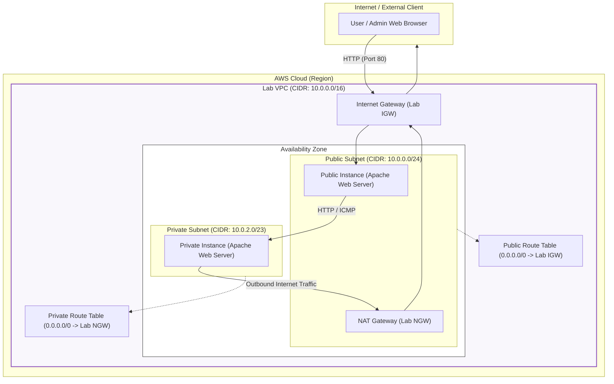

# AWS VPC Infrastructure & Deployment Flow Diagram

This document contains flow diagrams, architecture charts, and detailed structural information for building a custom, multi-tier Amazon Virtual Private Cloud (VPC). The setup includes a public subnet (connected to the Internet via an Internet Gateway) and a private subnet (connected to the Internet outbound-only via a NAT Gateway), along with public and private Amazon EC2 instances to verify inbound and outbound connectivity.

---

## 1. AWS VPC Architecture Diagram

The diagram below represents the final network architecture deployed in this lab, illustrating how the components are logically organized and how traffic flows.



---

## 2. Lab Procedural Step-by-Step Flowchart

The following flowchart details the step-by-step procedure to build and verify this network topology manually.

```mermaid
flowchart TD
    %% Task 1
    T1["Start: Task 1"] --> T1_1["Create Lab VPC (CIDR: 10.0.0.0/16)"]
    T1_1 --> T1_2["Modify VPC Settings: Enable DNS Hostnames"]
    
    %% Task 2
    T1_2 --> T2_1["Create Public Subnet (CIDR: 10.0.0.0/24 in AZ-1)"]
    T2_1 --> T2_2["Edit Subnet Settings: Enable Auto-assign Public IP"]
    T2_2 --> T2_3["Create Private Subnet (CIDR: 10.0.2.0/23 in AZ-1)"]
    
    %% Task 3 & 4
    T2_3 --> T3_1["Create Internet Gateway (Lab IGW)"]
    T3_1 --> T3_2["Attach Lab IGW to Lab VPC"]
    T3_2 --> T4_1["Create Public Route Table"]
    T4_1 --> T4_2["Add Route to Public RT: 0.0.0.0/0 -> Lab IGW"]
    T4_2 --> T4_3["Associate Public RT with Public Subnet"]
    
    %% Task 5 & 6
    T4_3 --> T5_1["Create Public Security Group (Public SG: HTTP Port 80 from Anywhere)"]
    T5_1 --> T6_1["Launch Public Instance (t3.micro, Public Subnet, Public SG)"]
    T6_1 --> T6_2["Inject User Data to install Apache & PHP"]
    
    %% Task 7 & 8
    T6_2 --> T7_1["Verify Web Server Page via Public DNS"]
    T7_1 --> T8_1["Connect via SSM Session Manager & Verify Internet Connectivity"]
    
    %% Task 9 & 10
    T8_1 --> T9_1["Create NAT Gateway (Lab NGW) in Public Subnet + Allocate EIP"]
    T9_1 --> T9_2["Create Private Route Table"]
    T9_2 --> T9_3["Add Route to Private RT: 0.0.0.0/0 -> Lab NGW"]
    T9_3 --> T9_4["Associate Private RT with Private Subnet"]
    T9_4 --> T10_1["Create Private Security Group (Private SG: HTTP Port 80 from Public SG)"]
    
    %% Task 11 & 12
    T10_1 --> T11_1["Launch Private Instance (t3.micro, Private Subnet, Private SG)"]
    T11_1 --> T11_2["Inject User Data to install Apache & PHP"]
    T11_2 --> T12_1["Connect to Private Instance via SSM & Verify Outbound Internet via NAT GW"]
    
    %% Optional Tasks
    T12_1 --> Opt1_1["Optional: Troubleshoot Connectivity (Curl Private IP from Public Instance)"]
    Opt1_1 --> Opt1_2{"Is Ping Working?"}
    Opt1_2 -- No --> Opt1_3["Update Private SG: Add Inbound ICMP from Public SG"]
    Opt1_3 --> Opt1_4["Ping succeeds!"]
    Opt1_2 -- Yes --> Opt1_4
    
    Opt1_4 --> Opt2_1["Optional: Retrieve Instance Metadata using IMDSv2 Token"]
    Opt2_1 --> End["End of Lab"]
```





---

## 3. Resource Inventory & Configuration Details

Below is a detailed inventory of the resources deployed throughout this configuration:

| Resource Type | Resource Name / Tag | CIDR Block / IP Settings | Key Settings & Routing Details |
| :--- | :--- | :--- | :--- |
| **VPC** | `Lab VPC` | `10.0.0.0/16` | Enable DNS Hostnames = `True` |
| **Subnet (Public)** | `Public Subnet` | `10.0.0.0/24` | Auto-assign Public IP = `Enabled` |
| **Subnet (Private)** | `Private Subnet` | `10.0.2.0/23` | Auto-assign Public IP = `Disabled` |
| **Internet Gateway** | `Lab IGW` | N/A | Attached to `Lab VPC` |
| **NAT Gateway** | `Lab NGW` | Elastic IP allocated | Deployed in `Public Subnet` for private instance egress |
| **Route Table (Pub)** | `Public Route Table` | Local: `10.0.0.0/16`<br/>Outbound: `0.0.0.0/0` -> `Lab IGW` | Associated with `Public Subnet` |
| **Route Table (Priv)**| `Private Route Table`| Local: `10.0.0.0/16`<br/>Outbound: `0.0.0.0/0` -> `Lab NGW` | Associated with `Private Subnet` |
| **Security Group (Pub)**| `Public SG` | Inbound: HTTP (80) from `0.0.0.0/0` | Associated with `Public Instance` |
| **Security Group (Priv)**| `Private SG` | Inbound: HTTP (80) from `Public SG`<br/>Optional: ICMP from `Public SG` | Associated with `Private Instance` |
| **EC2 Instance (Pub)**| `Public Instance` | Private IP in `10.0.0.0/24`<br/>Public IP Auto-assigned | IAM: `EC2InstProfile` (SSM Access)<br/>OS: Amazon Linux 2023 |
| **EC2 Instance (Priv)**| `Private Instance`| Private IP in `10.0.2.0/23`<br/>No Public IP | IAM: `EC2InstProfile` (SSM Access)<br/>OS: Amazon Linux 2023 |

---

## 4. Verification Commands

### 1. Verification of Outbound Connectivity via NAT Gateway (From Private Instance)
Run via Session Manager on the **Private Instance**:
```bash
cd ~
curl -I https://aws.amazon.com/training/
```
*Expected Output:* `HTTP/2 200` along with connection headers.

### 2. Verifying Multi-Tier Inbound Connectivity (From Public Instance to Private Instance)
Run via Session Manager on the **Public Instance**:
```bash
curl <PRIVATE_IP_OF_PRIVATE_INSTANCE>
```
*Expected Output:* Apache HTML response showing the Private Instance's ID and availability zone.

### 3. PING Troubleshooting (Optional Task 1)
Run via Session Manager on the **Public Instance**:
```bash
ping <PRIVATE_IP_OF_PRIVATE_INSTANCE>
```
*If fails:* Edit `Private SG` inbound rules to allow **All ICMP - IPv4** with Source set to `Public SG` security group ID.

### 4. Retrieving Instance Metadata (IMDSv2)
Run via Session Manager on the **Public Instance**:
```bash
# Get the IMDSv2 Session Token
TOKEN=`curl -X PUT "http://169.254.169.254/latest/api/token" -H "X-aws-ec2-metadata-token-ttl-seconds: 21600"`

# Retrieve all metadata paths
curl -H "X-aws-ec2-metadata-token: $TOKEN" -v http://169.254.169.254/latest/meta-data/

# Retrieve the public hostname
curl http://169.254.169.254/latest/meta-data/public-hostname -H "X-aws-ec2-metadata-token: $TOKEN"
```
